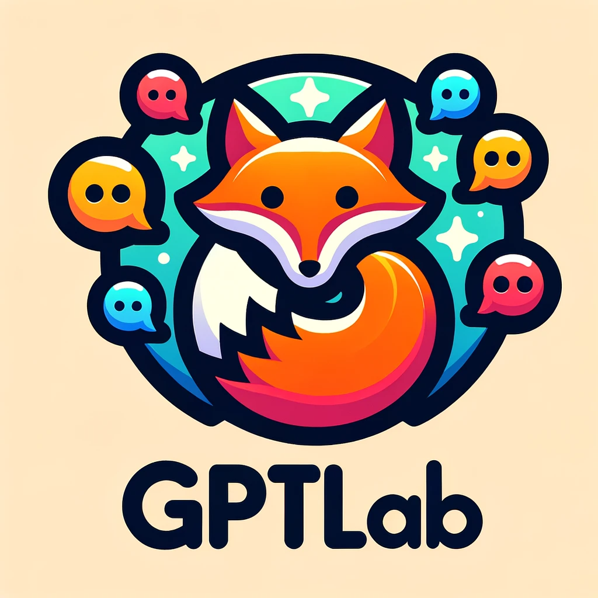

# Gptlab



Gptlab is an integration plugin designed to connect ChatGPT with GitLab. Its main functionality revolves around enabling users to browse merge requests, analyze code, and extract various details related to projects directly within the chat interface. This offers a seamless and efficient way to keep track of GitLab projects without the need to continuously check the platform.

## Project Setup

### Prerequisites:

Ensure you have Docker and docker-compose installed on your machine.

### Initial Steps:

1. **Environment Variables:** Make sure you have set the necessary environment variables in your `.env` file.
   
   - `GITLAB_API_URL`: The URL of your GitLab instance.
   
   - `GITLAB_PERSONAL_TOKEN`: This is your personal access token from GitLab. If you don't have one, you can create it by going to GitLab -> User Settings -> Access Tokens. Ensure the token has the required permissions to read the repository and other relevant scopes.

2. **Running the Service:** Use docker-compose to spin up the application. In the root directory, run:
   ```
   docker-compose build 
   docker-compose up
   ```

Once the application is running, you can access the FastAPI's automatic interactive API documentation at `http://localhost:3000/docs`.

## Gptlab with ChatGPT

To integrate Gptlab with ChatGPT, you need to:

1. Set up and run the Gptlab plugin on your server (as described above).
2. Connect your ChatGPT instance to the Gptlab API endpoint. Usually, this involves providing the Gptlab API endpoint (`http://localhost:3000/`) to ChatGPT.

## Sample Prompt for ChatGPT

Once you've integrated the Gptlab plugin with ChatGPT, you can ask the following question to understand what ChatGPT can do with the Gptlab plugin:

```
Hello ChatGPT, what can you do with the Gptlab plugin?
```

In response, ChatGPT will provide a list of available functionalities and operations it can perform using the Gptlab plugin, such as browsing merge requests, analyzing code, and answering questions about project details.
